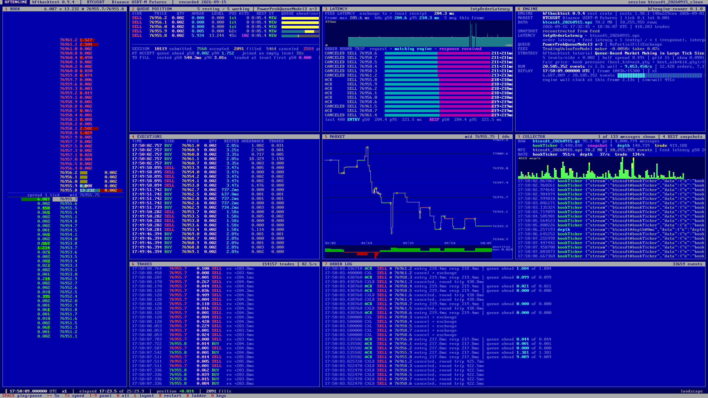

# hftengine

A replay console for [hftbacktest](https://github.com/nkaz001/hftbacktest) market-making
backtests. It runs one of hftbacktest's own tutorial strategies against real recorded Binance USDT-M
Futures order-book data and shows what the engine sees and decides, frame by frame: the local order
book, every resting order with its exchange-side queue estimate, feed and order latencies, market
trades, executions, the raw feed the collector recorded, and the engine's own run statistics.



## Before you think about trading this

This repository is a backtester and a replay screen. Nothing in it places orders. What the backtest
leaves out, in numbers from the BTCUSDT session recorded here (25 minutes, 0.002 BTC orders):

1. **Fees.** The tutorial strategy assumes a 0.005% market-maker rebate, as the
   [tutorials state](https://hftbacktest.readthedocs.io/en/latest/tutorials/High-Frequency%20Grid%20Trading.html).
   A regular Binance USDT-M account pays a 0.02% maker fee. The spread was one tick 99.7% of the
   time; one tick is 0.013 bps of price, so the retail fee is 154 ticks per fill and the rebate is
   38 ticks the other way. The session traded about $413k of notional: $83 of fees at the retail
   rate against $21 of rebate at the tutorial rate. The economics of quoting BTC at the touch exist
   only inside a rebate program.
2. **Latency.** The data was recorded on a laptop in Europe: 200 ms feed latency, a 250 ms round
   trip. The tutorials' data was collected near the exchange at about 4 ms. Here, 24% of the
   strategy's post-only orders were rejected because the market had moved while they were in flight.
   Binance Futures runs in AWS Tokyo (docs:
   [market maker programs](https://hftbacktest.readthedocs.io/en/latest/market_maker_program.html),
   a page that carries its own out-of-date warning).
3. **Fills are modelled.** Queue position is a probabilistic estimate from level-2 data; there is no
   market impact and no partial fill. Order latency here is derived from feed latency, not measured;
   the docs describe measuring it by placing far-from-mid orders and cancelling them
   ([Order Latency Data](https://hftbacktest.readthedocs.io/en/latest/tutorials/Order%20Latency%20Data.html)).
   Their guidance for going live is to trade tiny size, plot live against backtest, adjust the queue
   model until they agree, and only then scale
   ([Debugging Backtesting and Live Discrepancies](https://hftbacktest.readthedocs.io/en/latest/debugging_backtesting_and_live_discrepancies.html)).
4. **No P&L is shown, deliberately.** The strategy is a documentation example, not a validated one.

Live trading is a separate, Rust-only part of hftbacktest with its own
[connector](https://github.com/nkaz001/hftbacktest/tree/master/connector); its example configs point
at the testnet. None of it is configured or used here.

```
hftengine/
  hftbacktest/      clone of nkaz001/hftbacktest (Rust crate, Python package, data collector)
  patches/          the one change made to the clone (read-only queue-position getters)
  runner/           Rust binary: strategy + frame recorder on top of the hftbacktest crate
  dashboard/        Vite + TypeScript replay UI (text-mode look, IBM VGA bitmap font)
  tools/            collect.py (collector start/stop), prepare.py (raw -> npz/latency/facts),
                    session.py (one command: raw -> recording -> staged session), hbr.py (reader)
  data/             raw/ (collector output), npz/, latency/, recordings/, sample/ (repo sample data)
```

## What is real and what is modelled

| On screen | Source |
| --- | --- |
| Order book, trades, feed latency | Recorded Binance USDT-M Futures websocket streams (`depth@0ms`, `trade`, `bookTicker` + REST snapshots) written by hftbacktest's collector on this machine; converted with `hftbacktest.data.utils.binancefutures.convert` |
| Queue ahead / level / hits | hftbacktest's `ProbQueueModel` (`PowerProbQueueFunc3`, n=3) state for each resting order, read from the exchange-side order via `QueuePos::front_q_qty()` (see `patches/`). This is the estimate the exchange model uses to decide fills. |
| Order entry / response latency | `IntpOrderLatency` fed with order-latency data derived from the recorded feed latency with the "Order Latency Data" tutorial's generator. The tutorial's multipliers (entry 4x, response 3x) were set for a colocated feed of a few ms; here the feed itself already takes one WAN hop (~210 ms exchange timestamp to local receipt, measured), so the default is 1x / 1x: an order is assumed to need one hop to reach the matching engine and one hop back (`tools/session.py --mul-entry/--mul-resp` to change). For reference, a keep-alive HTTPS round trip from this machine to `fapi.binance.com` measured ~250 ms. |
| Fills, rejections, cancels | `NoPartialFillExchange` with GTX (post-only) limit orders |
| Strategy | "Queue-Based Market Making in Large Tick Size Assets" tutorial: book-pressure fair price, inventory skew, half spread 0.49 tick, 1-tick grid (`--strategy grid` gives the "High-Frequency Grid Trading" tutorial instead) |
| Run statistics | wall-clock and event counters of the actual runner process |

No P&L or equity is computed or shown.

## Get the code

The engine is a git submodule: a fork of nkaz001/hftbacktest with two read-only getters added
(`patches/`, branch `queue-position-getters`). Clone recursively so the `hftbacktest/` directory is filled:

```
git clone --recursive https://github.com/mirkovicdev/hftengine
cd hftengine
```

If you cloned without `--recursive`, run `git submodule update --init`.

## Setup (Windows, done once)

```
# Rust toolchain (MSVC)      https://rustup.rs
# Python 3.11+ with uv        https://docs.astral.sh/uv/
# Node 18+

uv venv --python 3.13 .venv
uv pip install --python .venv/Scripts/python.exe hftbacktest numpy polars numba
(cd hftbacktest && cargo build --release -p collector)
(cd runner && cargo build --release)
(cd dashboard && npm install)
```

## Record your own data

```
.venv/Scripts/python tools/collect.py start --symbols BTCUSDT ETHUSDT   # public websocket, no API key
.venv/Scripts/python tools/collect.py status
.venv/Scripts/python tools/collect.py stop                               # graceful Ctrl+C, finishes the gzip
```

Raw files land in `data/raw/<symbol>_<yyyymmdd>.gz`, one line per message: `<local receipt ns> <raw json>`.
Local timestamps come from this PC's clock (measured offset to Binance server time: about -20 ms), so
feed latencies carry that uncertainty; `convert` only shifts timestamps if a latency would be negative.

## Build a session and replay it

```
.venv/Scripts/python tools/session.py --raw data/raw/btcusdt_20260915.gz --name btcusdt_20260915
cd dashboard && npm run dev          # http://127.0.0.1:5180/?session=btcusdt_20260915
```

`session.py` converts the raw file, derives the order-latency file, computes collector facts, runs the
runner and copies the outputs to `dashboard/public/sessions/`. Runner options can be appended after
`--` (`--grid-num`, `--order-qty`, `--queue-model`, `--strategy`, `--max-minutes`, ... see
`runner/target/release/hftengine-runner.exe --help`).

The sample session committed in the repo (`?session=sample`, the default in a fresh clone) is built
from the 11 minutes of 2024 BTCUSDT data that ships in `hftbacktest/examples/usdm`; every other session
is built locally with `tools/session.py` and is not committed.

Sessions built on 2026-09-15 from this machine's own recording (17:32:45 to 18:36:07 UTC):

| session | content |
| --- | --- |
| `btcusdt_20260915_clean` (default) | first 25.5 minutes of BTCUSDT, stable ~200 ms feed latency, no feed gaps |
| `btcusdt_20260915` | the full 63 minutes; the websocket connection degraded between 17:58:30 and 18:15:32 UTC (t = 1545 s to 2567 s): intermittent multi-second feed latency and a 6.8 s gap at 18:03:53, which the feed-derived order latency inherits |
| `ethusdt_20260915` | ETHUSDT over the same hour (order size 0.05), same degraded window |

`python tools/hbr.py data/recordings/<name>.hbr moments` lists the times worth recording in each.

## Dashboard

URL parameters

| parameter | meaning |
| --- | --- |
| `session=<name>` | which session to load (default: the last one built by `tools/session.py`, else `sample`) |
| `layout=landscape\|portrait` | all nine panels in a grid (default), or a vertical stack for 9:16 clips |
| `panels=book:3,queue:2` | panels (and relative heights) in portrait |
| `panel=<key>` | focus one panel: `book queue latency fills market tape log engine collector` |
| `zoom=1\|2\|3` | integer zoom; the bitmap font stays pixel-exact |
| `safe=0.16` | fraction of the height left blank at top and bottom in portrait (room for overlays) |
| `frame=1080x1920` | fixed app size in device pixels, centred on black (record just that region) |
| `t=<sec>` `speed=<x>` `play=0\|1` | start time, replay speed, autoplay |
| `ladder=levels\|ticks` | ladder rows: populated levels only, or every tick |
| `keys=0` | hide the key bar |

Keys: `SPACE` play/pause, `Left/Right` seek 5 s (`Shift` 30 s), `Up/Down` speed, `1`-`9` focus a
panel, `0` all panels, `L` layout, `B` ladder mode, `R` restart, `H` key bar. The URL is kept in sync,
so a view can be reproduced exactly (same session file, same `t`).

Recording tips: use an integer zoom (2 on a 2560x1440 screen), focus a panel with its number, and for
9:16 clips open e.g.
`?session=btcusdt_20260915&layout=portrait&panels=book:3,queue:2&zoom=2&frame=1080x1920&t=300`.

Utilities: `python tools/hbr.py data/recordings/<name>.hbr` prints session statistics and
`python tools/hbr.py <file> moments` lists replay times worth recording (longest queue waits before a
fill, largest queues joined, most-hit resting orders, post-only rejection bursts).
`node dashboard/shot.mjs <url> <w> <h> <out.png>` takes a pixel-exact screenshot with Playwright.

## Fonts

The Ultimate Oldschool PC Font Pack (VileR, CC BY-SA 4.0) - `WebPlus_IBM_VGA_9x16`, `WebPlus_IBM_EGA_8x8`
- and Departure Mono (Helena Zhang, SIL OFL), licenses in `dashboard/public/fonts/`.
